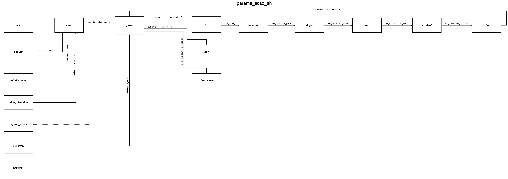

.. _simul_diagrams:

Simulation diagrams
===================

Here are some example of simulation diagrams generated by the :class:`specula.simul.Simul` class.

The diagram corresponding to the parameters file ``config/scao/params_scao_sh.yml`` can be generated during a simulation with the following command:

.. code-block:: bash

    specula params_scao_sh.yml --diagram

A file named ``params_scao_sh.png`` will be created in the current directory, containing the diagram of the simulation.
The diagram is:

Another example is the diagram corresponding to the parameters file ``config/scao/params_control_lpf.yml``:

Diagram options
---------------

The diagram generation supports several options:

- ``--diagram``: generate a diagram of the simulation.
- ``--diagram-title "My Title"``: set a custom title for the diagram.
- ``--diagram-filename my_diagram.png``: set the output filename for the diagram.
- ``--diagram-colors-on``: color blocks by device index and process rank for easier visualization of parallel/distributed simulations.

You can also specify multiple parameter files and override parameters from the command line using the ``--override`` option.

Example with custom options:

.. code-block:: bash

    specula params_scao_sh.yml --diagram --diagram-title "SCAO Simulation" --diagram-colors-on

Legend
------

If you use ``--diagram-colors-on``, a legend will be added to the diagram to indicate the meaning of the colors (device index and process rank).

For more details, see the documentation of the :class:`specula.simul.Simul` class.